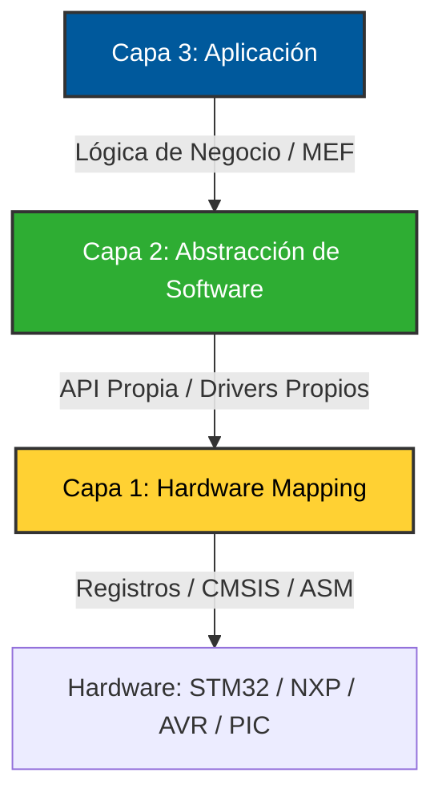

# ¡Hola! Soy Carlos, futuro Ingeniero Electrónico 🇦🇷

---

  
  
  
  
  
  
  
  
  
  
  

---

Estudiante de 4° año de Ingeniería Electrónica en la **Universidad Tecnológica Nacional (UTN FRT)** y desarrollador autodidacta apasionado por los sistemas embebidos. Mi enfoque principal es el desarrollo de firmware de bajo nivel, priorizando el control absoluto sobre el hardware y la robustez del código mediante la creación de capas de abstracción propias.

---

## 🛠️ Stack Técnico & Toolchain

Mi flujo de trabajo se centra en la independencia de IDEs comerciales, utilizando un entorno profesional y altamente configurable:

* **Microcontroladores:** * **ARM Cortex-M4/M0:** STM32 Nucleo-F439ZI, NXP LPC4337 (EDU-CIAA).
  * **8-bit Mastery:** Microchip **PIC16F84A** (ASM) y AVR ATmega328p (Bare-metal C).
* **Lenguajes:** C y **Assembly **.
* **Arquitecturas:** * **8-bit RISC:** Dominio de **Microchip PIC** (Estructura Harvard, gestión de bancos) y **AVR ATmega** (Arquitectura Single-cycle, Bare-metal).
  * **32-bit ARM Cortex-M:** Especialización en núcleos **M4** (STM32 Nucleo-F439ZI) y núcleos duales **M4/M0** (NXP LPC4337 - EDU-CIAA).
* **Toolchain Local:** VS Code + GCC + Makefiles | **MPLAB X + MPASM / PIC-AS**.
* **Periféricos & Protocolos:** * Dominio de **Timers avanzados** (Maestro/Esclavo), ADC, EXTI.
  * Comunicación serie: UART, SPI, I2C.

---

## 🏗️ Metodología de Desarrollo

Para garantizar un código mantenible y facilitar la migración entre distintas familias de microcontroladores, implemento una **Arquitectura de Software por Capas**:

1. **Capa 1: Hardware Mapping & Low-Level**
   - **Enfoque:** Acceso directo a registros mediante máscaras y punteros.
   - **Implementación:** Uso de definiciones de registros (CMSIS/SVD para ARM o `avr/io.h` para AVR) para configurar el silicio desde sus cimientos.

2. **Capa 2: Abstracción de Hardware (Drivers Propios)**
   - **Enfoque:** Creación de una **API propia** que encapsula la complejidad del hardware o de librerías base (**HAL de ST** o **LPCOpen**).
   - **Implementación:** Desarrollo de drivers modulares (GPIO, ADC, UART, Timers) con niveles de complejidad básico, medio y avanzado.

3. **Capa 3: Aplicación & Lógica de Control**
   - **Enfoque:** Implementación de la lógica de negocio y comportamiento del sistema.
   - **Implementación:** Uso de **Máquinas de Estados Finitos (MEF)** para orquestar las tareas, interactuando únicamente con la Capa 2.

```mermaid
graph TD
    A[Capa 3: Aplicación] -->|Lógica de Negocio / MEF| B[Capa 2: Abstracción de Software]
    B -->|API Propia / Drivers Propios| C[Capa 1: Hardware Mapping]
    C -->|Registros / CMSIS / ASM| D[Hardware: STM32 / NXP / AVR / PIC]
    
    style A fill:#00599C,stroke:#333,stroke-width:2px,color:#fff
    style B fill:#2EAD33,stroke:#333,stroke-width:2px,color:#fff
    style C fill:#FFD133,stroke:#333,stroke-width:2px,color:#000
```
---

## 🚀 Proyectos Destacados

| Repositorio | Hardware | Foco Técnico |
| :--- | :--- | :--- |
| [**Edu-CIAA-LPC4337-LPCOpen-Lab**](https://github.com/CarlitozMF/Edu-CIAA-LPC4337-LPCOpen-Lab) | **EDU-CIAA (LPC4337)** | Estudio de arquitectura dual-core y dominio del silicio mediante LPCOpen. |
| [**Notas-sobre-STM32-y-Sistemas-Embebidos**](https://github.com/CarlitozMF/Notas-sobre-STM32-y-Sistemas-Embebidos) |  **Ecosistema STM32** | Guía completa de 32 bits: Uso de STM32CubeIDE y HAL para el desarrollo de drivers propios (Nivel Básico, Medio y Avanzado). |
| [**AVR-BareMetal-Lab**](https://github.com/CarlitozMF/AVR-BareMetal-Lab) | **ATmega328p** | Programación Bare Metal en C y desarrollo de una capa de abstracción de software (API propia) desde cero. |
| [**AVR-Toolchain-Portable**](https://github.com/CarlitozMF/AVR-Toolchain-Portable) | **Toolchain** | Configuración de entorno de compilación independiente para AVR. |
| [**PIC16F84A-Mastery**](https://github.com/CarlitozMF/PIC16F84A-Mastery) | **PIC16F84A** | Inmersión en arquitectura Harvard: Dominio de ASM, gestión de bancos de memoria y migración de código legacy a estándares industriales modernos (PIC-AS). |

---

## 📊 Estadísticas de GitHub

---

## 📚 Formación & Objetivos

* 🎓 **Ingeniería Electrónica (4° Año)** – Universidad Tecnológica Nacional (**UTN FRT**).
* 🎯 **Objetivo Profesional:** Orientar mi carrera hacia el desarrollo de **Sistemas Embebidos**, con un fuerte enfoque en la comprensión profunda de la arquitectura de hardware. Mi meta es dominar el diseño de firmware eficiente y robusto, aplicando los fundamentos de la ingeniería electrónica al control directo de microcontroladores.
* 🚀 **Perfil:** Estudiante avanzado y desarrollador **autodidacta**. Enfocado en la transición de la teoría académica al control total del silicio, construyendo drivers y capas de abstracción propias para entender qué sucede en cada ciclo de instrucción.
* 📫 **Contacto:** [albertdilbert@gmail.com]

---

  <i>"La electrónica es la ciencia de lo pequeño, pero el firmware es el arte de hacerlo cobrar vida."</i>

